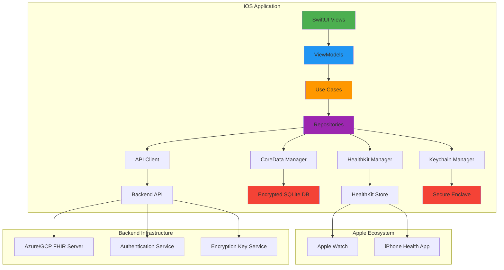
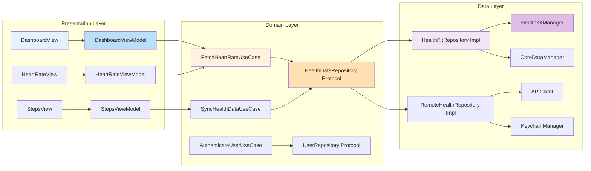
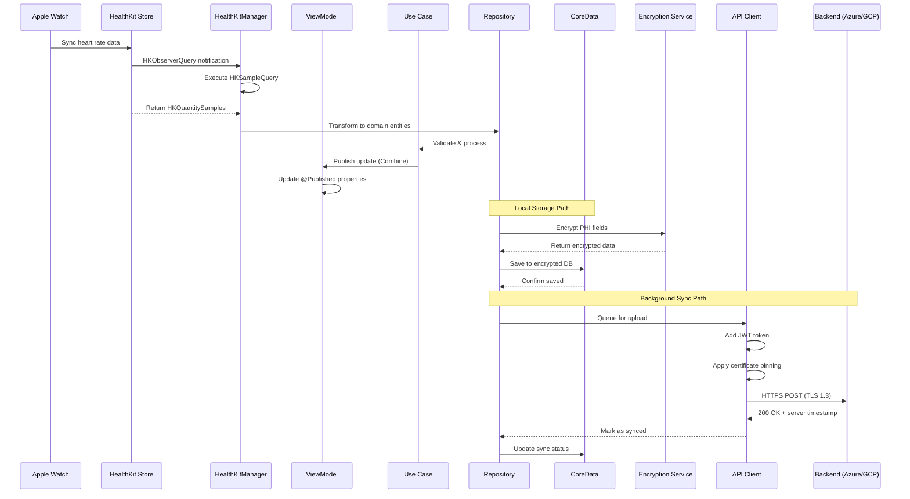
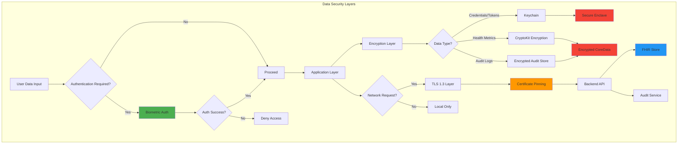
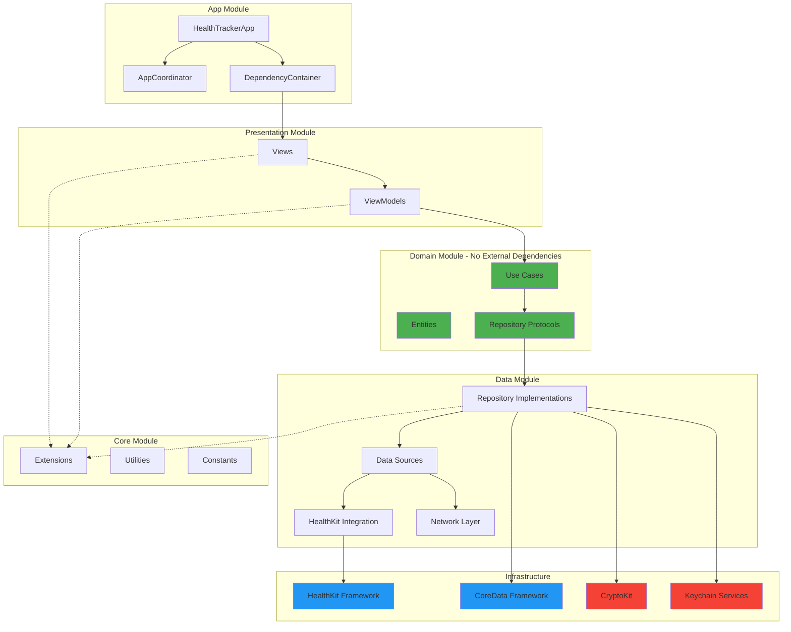
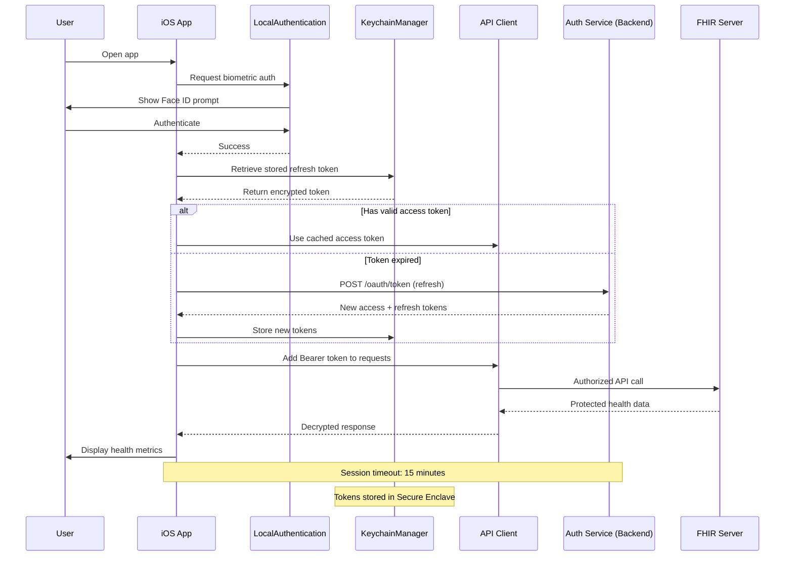
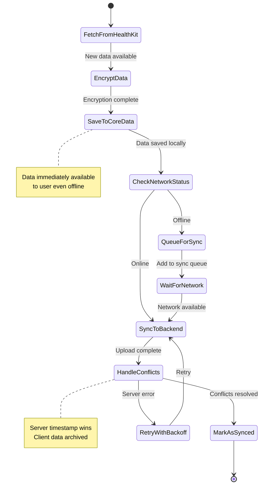
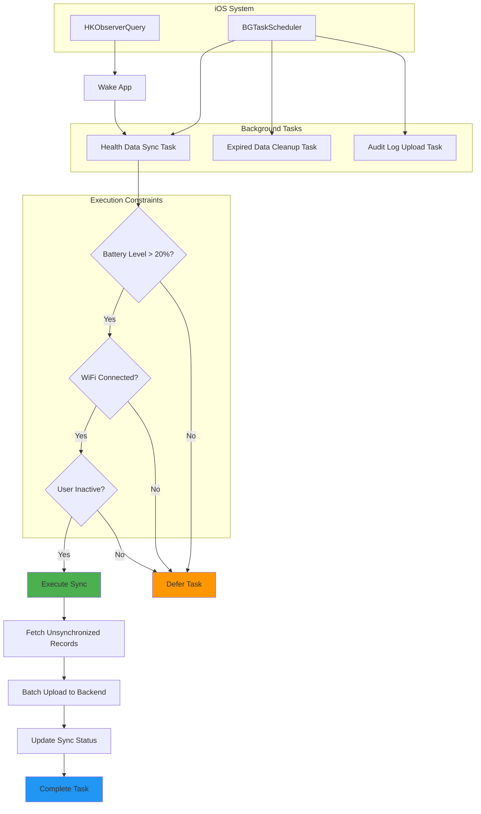
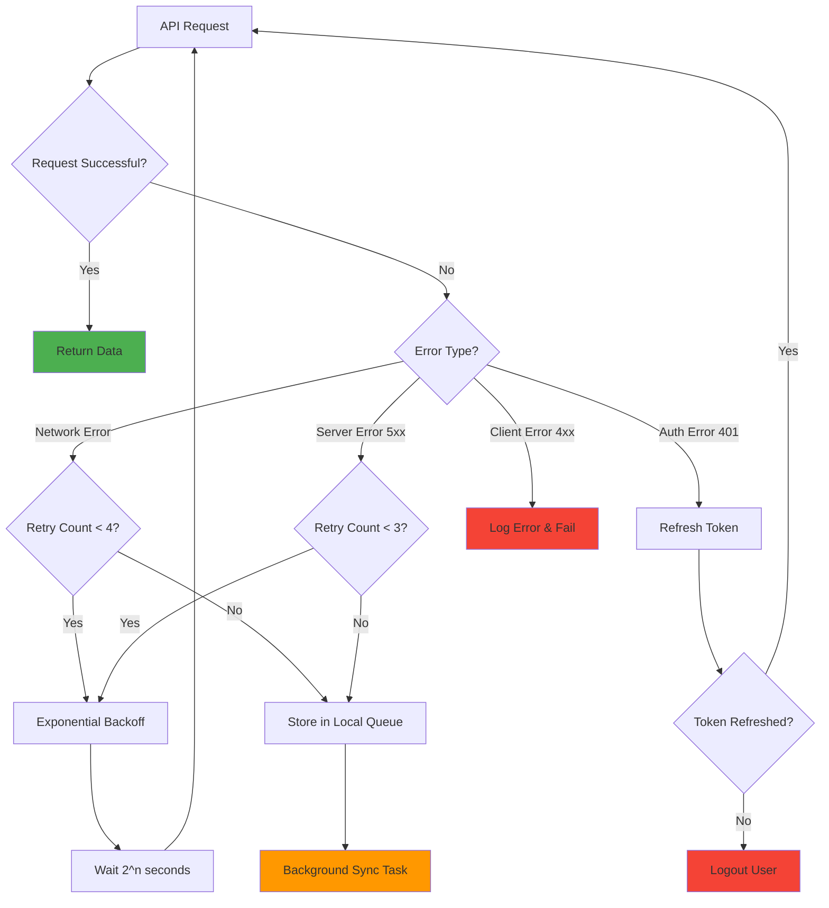
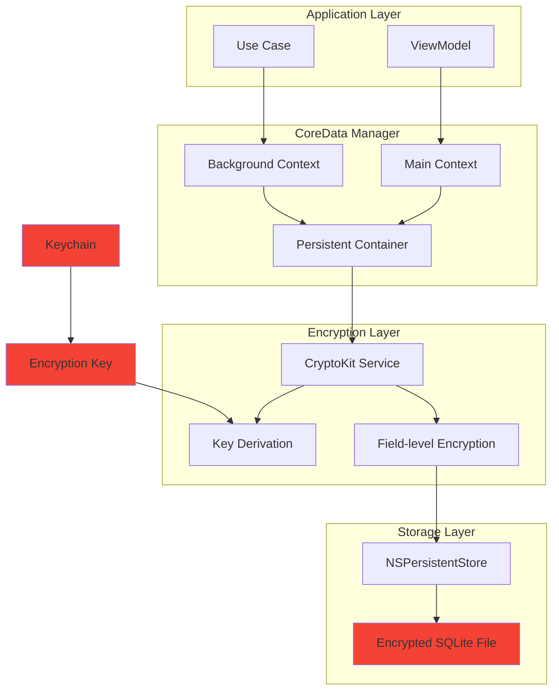

# Health Tracker App - Architecture Diagrams

## 1. System Architecture Overview

---

## 2. Layered Architecture (Clean Architecture + MVVM)

---

## 3. Data Flow: HealthKit to Backend

---

## 4. Security Architecture

---

## 5. Module Dependencies

---

## 6. Authentication Flow

---

## 7. Offline-First Sync Strategy

---

## 8. Background Task Architecture

---

## 9. Error Handling & Retry Logic

---

## 10. CoreData Stack with Encryption

---

## Legend

- **Green**: User-facing components
- **Blue**: Business logic / Use cases
- **Purple**: Data layer
- **Red**: Security-critical components
- **Orange**: Network/API layer

---

**Note**: These diagrams are created using Mermaid syntax and can be rendered in:
- GitHub markdown files
- VS Code with Mermaid extension
- Online editors like mermaid.live
- Documentation platforms like GitBook, Notion, Confluence
